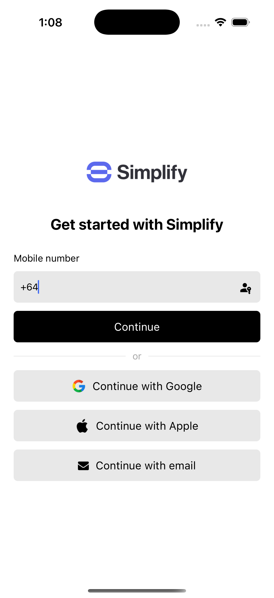

# Authsignal + Amazon Cognito lambda examples

This repository contains example lambdas for integrating Authsignal with Amazon Cognito.

## Example app

These lambdas are designed to be used together with our [React Native example app](https://github.com/authsignal/aws-cognito-react-native-example).



## Init SMS challenge

This lambda can be called to initiate an SMS challenge by sending an OTP code.

- [Init SMS challenge](https://github.com/authsignal/cognito-lambdas/blob/alternative-approach/api/init-sms-challenge.ts)

## Verify SMS challenge

This lambda can be called to verify an SMS challenge by checking the OTP code submitted by the user.
If the code is valid, then a user is created in Cognito with a verified phone number.

- [Verify SMS challenge](https://github.com/authsignal/cognito-lambdas/blob/alternative-approach/api/verify-sms-challenge.ts)

## Cognito triggers

The following lambdas are used for signing in to Cognito with SMS OTP, email OTP, passkey, or Apple or Google sign-in:

- [Define auth challenge](https://github.com/authsignal/cognito-lambdas/blob/alternative-approach/triggers/define-auth-challenge.ts)
- [Create auth challenge](https://github.com/authsignal/cognito-lambdas/blob/alternative-approach/triggers/create-auth-challenge.ts)
- [Verify auth challenge response](https://github.com/authsignal/cognito-lambdas/blob/alternative-approach/triggers/verify-auth-challenge-response.ts)

## Add authenticator endpoint

This lambda is called to authorize enrolling additional authentication methods - such as a passkey - via a Authsignal Client SDK once the user is signed in.

- [Add authenticator](https://github.com/authsignal/cognito-lambdas/blob/alternative-approach/api/add-authenticator.ts)

## Installation

```
yarn install
```

## Configuration

Rename `.env.example` to `.env` and provide the values for your AWS and Authsignal configuration.

```
ACCESS_KEY_ID=
SECRET_ACCESS_KEY=
USER_POOL_ID=
USER_POOL_CLIENT_ID=
AUTHSIGNAL_SECRET=
AUTHSIGNAL_URL=
```

## Deployment

This example uses [Serverless Framework](https://www.serverless.com/) to deploy the lambdas.

```
yarn deploy --region=YOUR_AWS_REGION
```

## Documentation

For more detailed information on how to integrate Authsignal with Amazon Cognito refer to our [official documentation](https://docs.authsignal.com/integrations/aws-cognito/getting-started).
