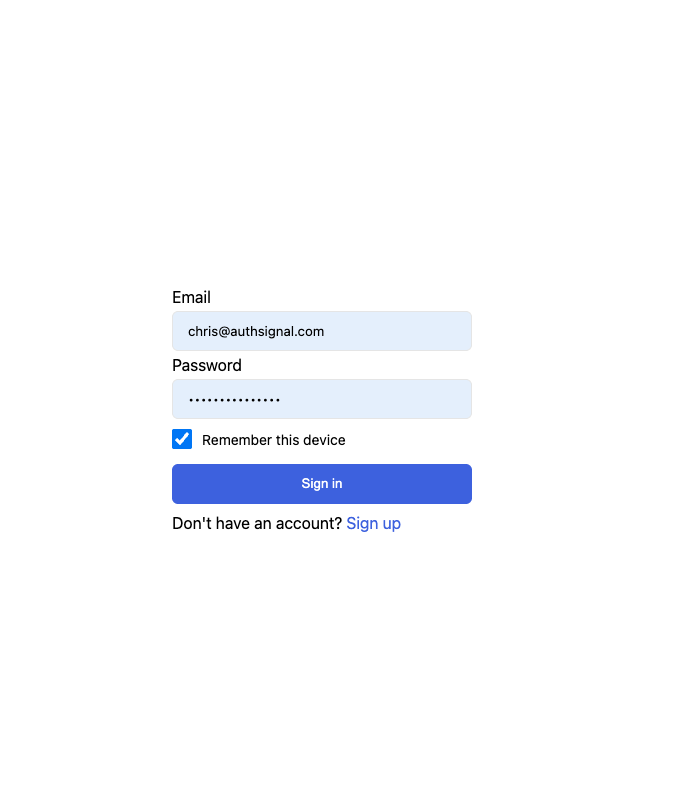
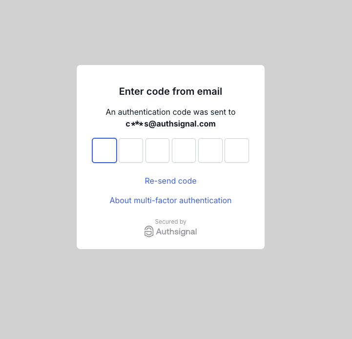

# Authsignal + Amazon Cognito lambda examples

This repository contains example lambdas for integrating Authsignal with Amazon Cognito.

## Example app

The lambdas in this branch are designed to be used with our Web app demonstrating how to implement "remember this device" functionality.

<p float="left">


</p>

## Installation

```
yarn install
```

## Configuration

Rename `.env.example` to `.env` and provide the values for your AWS and Authsignal configuration.

```
USER_POOL_ID=
USER_POOL_WEB_CLIENT_ID=
AUTHSIGNAL_SECRET=
AUTHSIGNAL_URL=
```

## Deployment

This example uses [Serverless Framework](https://www.serverless.com/) to deploy the lambdas.

```
yarn deploy --region=YOUR_AWS_REGION
```

## Documentation

For more detailed information on how to integrate Authsignal with Amazon Cognito refer to our [official documentation](https://docs.authsignal.com/integrations/aws-cognito/getting-started).
